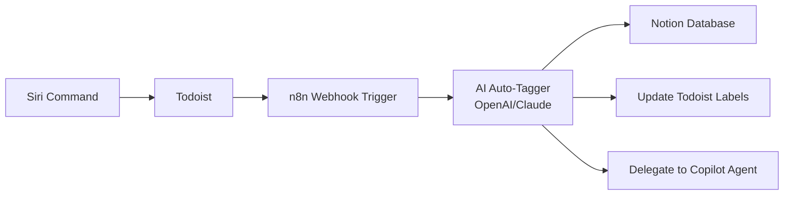
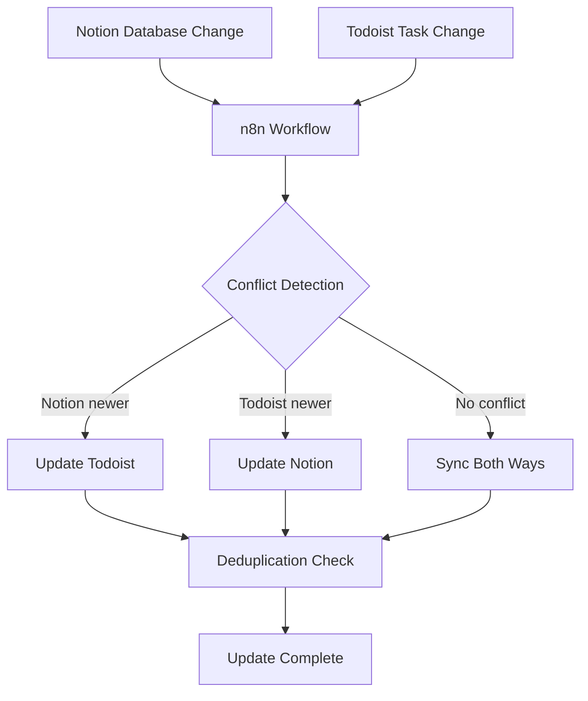
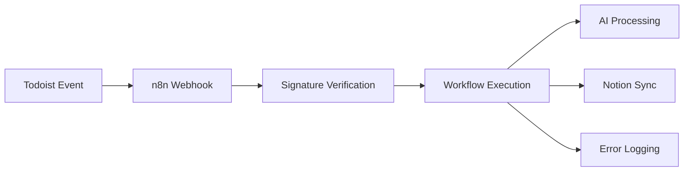

# Architecture

> **Note**: This project has pivoted from a custom orchestrator to n8n-based sync. See [ADR-001](docs/decisions/ADR-001-use-n8n-over-custom.md) for decision rationale.

## System Overview

The system provides ADHD-optimized task management with bidirectional sync between Todoist and Notion, powered by n8n. It consists of:

1. **n8n Workflow Engine** - Bidirectional sync + AI auto-tagging
2. **Quick Capture Layer** - Siri → Todoist (< 5 seconds)
3. **AI Processing** - OpenAI/Claude via n8n nodes for categorization
4. **GitHub Copilot Agents** - @research/@code task delegation
5. **Raycast Extensions** - Quick capture and search interfaces

**Why n8n?** €20/mo includes all AI features (OpenAI, LangChain, multi-agent), 2,500 executions, and eliminates 20-40 hours of custom development. See [STRATEGIC-VALUE-ANALYSIS.md](docs/STRATEGIC-VALUE-ANALYSIS.md) for comprehensive comparison.

## Data Flow

### Quick Capture Flow (< 5 seconds)



**Example**: "Siri, remind me to research OAuth for GitHub integration"
1. Todoist receives command, parses natural language → task created
2. n8n webhook triggered (< 1 second)
3. OpenAI node analyzes: "OAuth" + "GitHub" → @work @urgent @research tags
4. Notion database updated with full context + AI confidence score
5. Todoist labels synced back
6. If @research tag detected → GitHub Copilot Agent triggered

### Bidirectional Sync Flow



**Conflict Resolution Logic**:
- **Timestamp-based**: Most recent change wins
- **Priority override**: Todoist priority 1 (urgent) always syncs to Notion
- **Deduplication**: SHA-256 hash of content prevents infinite loops
- **Error handling**: Failed syncs logged to Notion "Sync Errors" database

### AI Auto-Tagging Flow

```mermaid
graph LR
    A[Task Content] --> B[OpenAI/Claude Node]
    B --> C[Tag Extraction]
    C --> D[@work/@personal]
    C --> E[@urgent/@low]
    C --> F[@research/@code/@admin]
    D --> G[Update Both Systems]
    E --> G
    F --> G
    G --> H[AI Confidence Score]
```

**AI Prompt Template** (embedded in n8n):
```
Analyze this task and suggest tags:
Task: "{{ $json.content }}"
Available tags: @work, @personal, @urgent, @low, @research, @code, @admin

Return JSON:
{
  "tags": ["@work", "@urgent", "@research"],
  "confidence": 0.92,
  "reasoning": "Task mentions OAuth (technical) and urgency implied"
}
```

### Agent Delegation Flow

```mermaid
graph TD
    A[n8n Detects @research or @code] --> B{Which Agent?}
    B -->|@research| C[GitHub Copilot Research Agent]
    B -->|@code| D[GitHub Copilot Code Agent]
    C --> E[GitHub Repo Search]
    C --> F[Documentation Scraping]
    C --> G[Summary Generation]
    G --> H[Create Notion Page]
    D --> I[Implement Feature]
    D --> J[Create Pull Request]
    J --> K[Update Todoist: Done]
    H --> K
```

**Implementation**: n8n HTTP Request node calls GitHub REST API to trigger Copilot Agents via `repos/{owner}/{repo}/dispatches` workflow_dispatch event.

## Component Architecture

### n8n Workflow Engine

**Primary Workflow: Bidirectional Sync + AI Auto-Tagging**

```yaml
Workflow Nodes:
1. Todoist Webhook Trigger
   - URL: https://n8n.example.com/webhook/todoist
   - Events: item_added, item_updated, item_completed
   
2. OpenAI/Claude Node (AI Auto-Tagger)
   - Model: gpt-4 or claude-3-sonnet
   - System prompt: Tag extraction rules
   - Output: { tags, confidence, reasoning }
   
3. Notion Node (Create/Update Database Item)
   - Database: Tasks
   - Properties:
     - Title: Task content
     - Status: From Todoist
     - Tags: AI-generated
     - Todoist_ID: Unique identifier
     - AI_Confidence: 0-1 score
     - Last_Synced: Timestamp
   
4. Todoist Node (Update Task)
   - Add AI-generated labels
   - Update priority if needed
   
5. HTTP Request Node (Trigger GitHub Copilot Agent)
   - Condition: @research or @code tag detected
   - Endpoint: GitHub API workflow_dispatch
   - Payload: Task context + agent type
   
6. Error Handler
   - Log to Notion "Sync Errors" database
   - Retry 3 times with exponential backoff
```

**Reverse Sync Workflow: Notion → Todoist**

```yaml
Workflow Nodes:
1. Notion Trigger (Database Item Updated)
   - Database: Tasks
   - Poll interval: 30 seconds (webhook support coming soon)
   
2. HTTP Request Node (Todoist API)
   - Endpoint: POST /rest/v2/tasks or PATCH /rest/v2/tasks/{id}
   - Conflict detection: Compare Last_Synced timestamp
   
3. Deduplication Node (Function)
   - Generate SHA-256 hash of content
   - Check against previous hash
   - Skip if identical (prevents infinite loop)
   
4. Update Notion (Set Last_Synced)
   - Timestamp current sync
```

**Key n8n Features Used:**
- **AI Nodes**: OpenAI, Anthropic Claude, LangChain
- **Webhooks**: Real-time Todoist triggers (< 1s latency)
- **HTTP Requests**: Notion API, Todoist API, GitHub API
- **Error Handling**: Try/Catch with retry logic
- **Credentials**: OAuth for Notion, API tokens for Todoist/GitHub
- **Execution**: 2,500/month (Starter plan €20), ~1,500 expected usage

**Why n8n Over Custom Orchestrator?**
- ✅ Visual workflow editor (faster iteration)
- ✅ Built-in AI nodes (no custom OpenAI integration needed)
- ✅ Webhook management (no Express server maintenance)
- ✅ Error handling + retry logic (production-ready)
- ✅ Template exists (90% of work done)
- ✅ €20/mo vs 20-40 hours development time

See [ADR-001](docs/decisions/ADR-001-use-n8n-over-custom.md) for comprehensive decision rationale.

### Archived Custom Orchestrator Code

> **Status**: Archived for reference (not deleted, ~80% complete)
> 
> The custom TypeScript orchestrator in `orchestrator/` remains as:
> - Learning reference for future AI features
> - Example TypeScript architecture with Zod validation
> - Demonstration of 1Password Service Account integration
> 
> **Not maintained**, **not deployed**, **not part of active system**.

### MCP Server Layer (GitHub Copilot Integration)

> **Note**: Custom Notion MCP server deprecated. Use official [makenotion/notion-mcp-server](https://github.com/makenotion/notion-mcp-server) instead.

**Active MCP Servers for GitHub Copilot:**

1. **Official Notion MCP Server** (replaces custom)
   - Install: `npm install -g @makenotion/notion-mcp-server`
   - Configure in `.copilot/config.json`:
     ```json
     {
       "mcpServers": {
         "notion": {
           "command": "notion-mcp-server",
           "env": {
             "NOTION_API_KEY": "${OP_NOTION_API_KEY}"
           }
         }
       }
     }
     ```
   - Tools: search_pages, create_page, update_page, query_database

2. **GitHub MCP Server** (for Copilot Agent triggers)
   - Used by n8n to trigger workflow_dispatch events
   - Not directly used by Copilot Chat (redundant)

3. **1Password MCP Server** (secret management)
   - Read-only access to Service Account items
   - Used by Copilot Chat: "Get my Notion API key from 1Password"
   - Tools: get_secret, list_items

**Configuration**: See [MCP-SERVER-SETUP.md](docs/MCP-SERVER-SETUP.md) for detailed setup instructions.

**Usage in Copilot Chat:**
```
User: "Search Notion for OAuth research tasks"
Copilot: [Uses Notion MCP] Found 3 pages: OAuth Integration, ...

User: "What's my Todoist API token?"  
Copilot: [Uses 1Password MCP] Retrieved from vault: op://...
```

### Webhook Receivers (n8n Managed)

**n8n handles all webhook endpoints** - no custom Express server needed.

**Todoist Webhook Configuration:**

1. **n8n Webhook Node:**
   - URL: `https://n8n.example.com/webhook/todoist-sync`
   - Authentication: Signature verification (HMAC-SHA256)
   - Events: item_added, item_updated, item_completed, item_deleted

2. **Configure in Todoist:**
   - Settings → Integrations → Webhooks
   - URL: n8n webhook URL
   - Secret: Store in 1Password, inject into n8n credentials

**Webhook Flow:**



**Benefits Over Custom Server:**
- ✅ Built-in signature verification
- ✅ Automatic retry on failure (3 attempts, exponential backoff)
- ✅ Error logging to execution history
- ✅ No server maintenance (n8n handles uptime)
- ✅ Webhook testing UI in n8n editor

### GitHub Copilot Agents (Task Delegation)

**Agent Trigger via n8n HTTP Request Node:**

```yaml
n8n Node Configuration:
- Type: HTTP Request
- Method: POST
- URL: https://api.github.com/repos/{owner}/{repo}/dispatches
- Headers:
    Authorization: Bearer {{ $credentials.github_pat }}
    Accept: application/vnd.github+json
- Body:
    event_type: "copilot_agent_trigger"
    client_payload:
      agent: "{{ $json.agent_type }}"  # research-agent or code-agent
      task_id: "{{ $json.todoist_id }}"
      prompt: "{{ $json.content }}"
      context:
        notion_page: "{{ $json.notion_url }}"
        priority: "{{ $json.priority }}"
```

**Agent Workflow Files:**

**`.github/workflows/research-agent.yml`**:
```yaml
name: Research Agent
on:
  repository_dispatch:
    types: [copilot_agent_trigger]
    
jobs:
  research:
    if: github.event.client_payload.agent == 'research-agent'
    runs-on: ubuntu-latest
    steps:
      - uses: actions/checkout@v4
      - name: Run GitHub Copilot Agent
        run: |
          gh copilot agent run \
            --agent research-agent \
            --prompt "${{ github.event.client_payload.prompt }}"
      - name: Update Notion with Results
        uses: makenotion/notion-github-action@v1
        with:
          notion-token: ${{ secrets.NOTION_API_KEY }}
          page-id: ${{ github.event.client_payload.context.notion_page }}
          content: ${{ steps.research.outputs.summary }}
```

**Agent Configurations** (in repo root):

- **`agents/research-agent.yml`**: GitHub search, doc scraping, summary generation
- **`agents/code-agent.yml`**: Implementation with PR creation

**Trigger Flow**:
1. n8n detects @research or @code tag in AI auto-tagger output
2. HTTP Request node calls GitHub repository_dispatch
3. GitHub Actions workflow triggered
4. Copilot Agent executes task
5. Results written to Notion page
6. Todoist task marked complete via n8n

**Alternative Manual Trigger**: `gh copilot agent run --agent research-agent --prompt "Research OAuth"`

### Raycast Extensions

```bash
# raycast-extensions/quick-task.sh
#!/usr/bin/env bash

# Quick capture to Todoist via Raycast
task="$1"
priority="${2:-4}"

curl -X POST "https://api.todoist.com/rest/v2/tasks" \
  -H "Authorization: Bearer $TODOIST_TOKEN" \
  -H "Content-Type: application/json" \
  -d "{\"content\":\"$task\",\"priority\":$priority}"
```

**Available Scripts:**
- `quick-task.sh` - Siri/Raycast → Todoist
- `save-to-notion.sh` - Clipboard → Notion page
- `search-everything.sh` - Unified search (Notion + Todoist + GitHub)

**Installation:**
- Copy to `~/.config/raycast/scripts/`
- Set executable: `chmod +x *.sh`
- Configure in Raycast preferences

## Security

### Secret Management

```
1Password Service Account
    ↓
orchestrator/src/secrets/onepassword.ts
    ↓
Load secrets at runtime:
├─→ NOTION_API_KEY
├─→ TODOIST_API_TOKEN
├─→ GITHUB_PAT
└─→ WEBHOOK_SECRET
    ↓
Store in memory (never disk)
```

**Best Practices:**
- ✅ Use 1Password Service Account (not Environments or `op inject`)
- ✅ Rotate tokens quarterly
- ✅ Scope GitHub PAT to minimum permissions
- ✅ Verify webhook signatures
- ❌ Never log secrets
- ❌ Never commit .env files

### Network Security

```
Local Mac (orchestrator)
    ↓
Tailscale VPN (100.x.x.x)
    ↓
├─→ Notion API (HTTPS)
├─→ Todoist API (HTTPS)
├─→ GitHub API (HTTPS)
└─→ 1Password API (HTTPS)
```

**Tailscale Benefits:**
- Private IP (no public exposure)
- End-to-end encryption
- Works behind NAT/firewall
- Access from iPhone/iPad via Tailscale app

## Deployment

### n8n Setup (Production)

**Option 1: n8n Cloud (Recommended)**

1. **Sign up**: https://n8n.io/trial (14-day free trial)
2. **Plan**: Starter €20/mo (2,500 executions, AI nodes included)
3. **Import workflow**:
   - Use combined prompt from Phase 17 (bidirectional sync + AI auto-tagging)
   - Or: Import JSON workflow template (when available)
4. **Configure credentials**:
   - Notion: OAuth connection
   - Todoist: API token from 1Password
   - GitHub: Personal Access Token for Copilot Agent triggers
   - OpenAI/Claude: API key for auto-tagging

**Option 2: n8n Self-Hosted (Community Edition - Free)**

```bash
# Docker Compose
version: '3.8'

services:
  n8n:
    image: n8nio/n8n:latest
    ports:
      - "5678:5678"
    environment:
      - N8N_BASIC_AUTH_ACTIVE=true
      - N8N_BASIC_AUTH_USER=admin
      - N8N_BASIC_AUTH_PASSWORD=${N8N_PASSWORD}
      - WEBHOOK_URL=https://n8n.example.com
    volumes:
      - n8n_data:/home/node/.n8n
    restart: unless-stopped

volumes:
  n8n_data:
```

**Commands**:
- `docker-compose up -d` - Start n8n
- `docker-compose logs -f n8n` - View logs
- Open http://localhost:5678 - Access n8n UI

**Self-Hosted Limitations**:
- ❌ No "Build with AI" workflow generator
- ❌ Manual workflow creation required
- ✅ Unlimited executions (no 2,500/mo limit)
- ✅ Full control, local LLM possible

### MCP Server Setup (GitHub Copilot)

**Install Official Notion MCP Server:**

```bash
# Global installation
npm install -g @makenotion/notion-mcp-server

# Configure in ~/.copilot/config.json
{
  "mcpServers": {
    "notion": {
      "command": "notion-mcp-server",
      "env": {
        "NOTION_API_KEY": "${OP_NOTION_API_KEY}"
      }
    }
  }
}
```

**Test in Copilot Chat:**
```
User: "Search Notion for OAuth tasks"
Copilot: [Uses Notion MCP] Found 3 pages...
```

See [MCP-SERVER-SETUP.md](docs/MCP-SERVER-SETUP.md) for detailed instructions.

## Monitoring

### n8n Execution Monitoring

**Built-in n8n Features:**

1. **Execution History**: View all workflow runs
   - Success/failure status
   - Execution time
   - Input/output data
   - Error stack traces

2. **Workflow Statistics**:
   - Executions: 1,500/month expected (60% of 2,500 Starter limit)
   - Success rate: Target 98%+ (retry logic handles transient failures)
   - Average execution time: < 3 seconds per sync

3. **Error Logging to Notion**:
   - Failed syncs logged to "Sync Errors" database
   - Includes: timestamp, error message, input data, retry count
   - Weekly review recommended

**Monitor Key Metrics:**

| Metric | Target | Alert Threshold |
|--------|--------|----------------|
| Sync latency | < 5 seconds | > 10 seconds |
| Success rate | > 98% | < 95% |
| AI confidence | > 0.8 average | < 0.6 average |
| Monthly executions | < 2,000 | > 2,300 (92% quota) |

### Health Checks

**n8n Webhook Test:**

```bash
# Test Todoist webhook
curl -X POST https://n8n.example.com/webhook/todoist-sync \
  -H "Content-Type: application/json" \
  -d '{"event_name":"item:added","event_data":{"content":"Test task"}}'

# Expected response: 200 OK
```

**Notion API Health:**

```bash
# Test Notion connectivity
curl https://api.notion.com/v1/users/me \
  -H "Authorization: Bearer $NOTION_API_KEY" \
  -H "Notion-Version: 2022-06-28"

# Expected: User object JSON
```

**Todoist API Health:**

```bash
# Test Todoist connectivity
curl https://api.todoist.com/rest/v2/tasks \
  -H "Authorization: Bearer $TODOIST_API_TOKEN"

# Expected: Array of tasks JSON
```

## Scaling Considerations

**Current Design (n8n Starter Plan):**

- ✅ Sufficient for 1 user (~1,500 executions/month)
- ✅ €20/mo fixed cost (no per-execution charges)
- ✅ All AI features included (OpenAI, Claude, LangChain)
- ✅ Cloud-hosted (no Mac uptime dependency)

**If exceeding 2,500 executions/month:**

1. **Optimize workflow**: Batch updates, reduce polling frequency
2. **Upgrade to Pro**: €50/mo (5,000 executions, advanced features)
3. **Self-host Community Edition**: Unlimited executions, free

**Future Multi-User (Not Planned):**

- Each user can have own n8n account (€20/mo per user)
- Or: Shared n8n Pro/Enterprise with user-scoped workflows
- Notion workspaces kept separate per user

## References

**Core Documentation:**

- [n8n Documentation](https://docs.n8n.io/)
- [n8n AI Workflows Guide](https://docs.n8n.io/integrations/builtin/cluster-nodes/root-nodes/ai/)
- [Notion API Reference](https://developers.notion.com/reference)
- [Todoist API Reference](https://developer.todoist.com/rest/v2)
- [GitHub Copilot Agents](https://github.com/features/copilot)

**Decision Records:**

- [ADR-001: Use n8n Over Custom Orchestrator](docs/decisions/ADR-001-use-n8n-over-custom.md)
- [ADR-002: Reject Motion](docs/decisions/ADR-002-reject-motion.md)
- [Strategic Value Analysis](docs/STRATEGIC-VALUE-ANALYSIS.md) - Comprehensive comparison
- [Lessons Learned](docs/LESSONS-LEARNED.md) - R&D process improvements

**Setup Guides:**

- [MCP Server Setup](docs/MCP-SERVER-SETUP.md) - GitHub Copilot integration
- [1Password Setup](docs/1PASSWORD-SETUP.md) - Service Account configuration
- [GitHub Best Practices](docs/GITHUB-BEST-PRACTICES.md) - Repository standards
- [Notion Workspace Architecture](docs/NOTION-WORKSPACE-ARCHITECTURE.md) - Database design

**Model Context Protocol:**

- [MCP Specification](https://modelcontextprotocol.io/docs)
- [Official Notion MCP Server](https://github.com/makenotion/notion-mcp-server)
- [1Password Service Accounts](https://developer.1password.com/docs/service-accounts)
